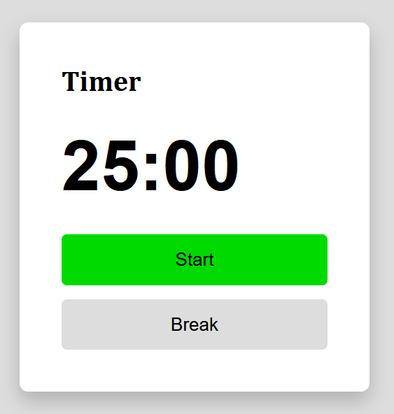
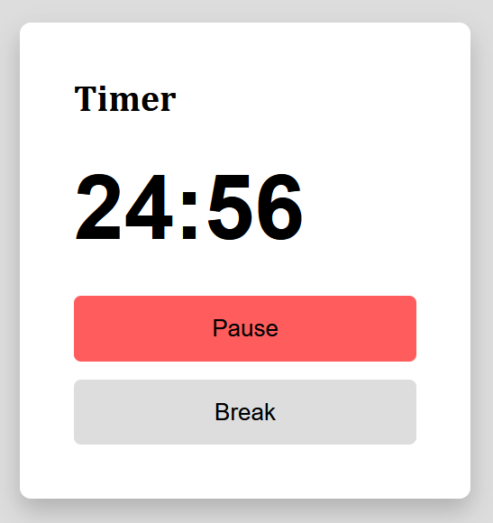

# JS Timer ⏳

A simple timer that can pause and resume.

## Features ✨

- Ability to pause and resume timer

## Installation & Usage 🛠️

1. Clone the repository using `git clone https://github.com/BeanyTheCoder/js-timer.git`.

2. Navigate to the project directory using `cd  js-timer`.
3. Open the `index.html` file using any web browser of your choice.

## Screenshots 📷

### Image of dormant timer

### Image of started timer

## Technologies Used 🛠️

- JavaScript
- HTML & CSS

## Roadmap 🗺️

I plan to add functionality for the break feature, and improve the styling. 

I'd also plan to refactor the JS and add comments sooner or later

## License 📝

This project is licensed under the [License Name](link-to-license-file).

## Contact 📧

For any questions or feedback, feel free to reach out to me at alexanderafoko@gmail.com.

## Project Status

In active development 🔥
